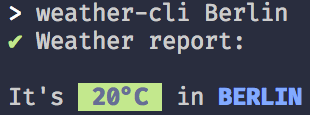

<p align="center">
  <p align="center">:sunny: :cloud: :zap:</p>
  <h3 align="center">weather cli</h3>
  <h3 align="center">weather cli</h3>
  <p align="center">CLI to get weather information from a place<p>
</p>

<p align="center"></p>

## Installation

via [npm](https://www.npmjs.com/) :package:
```bash
npm install --global @dominickolbe/weather-cli
```

## Usage
```bash
$ weather-cli <place or postal code>

  Examples
    $ weather-cli berlin
    $ weather-cli "New York"
    $ weather-cli 10247
```

### License
MIT License

Copyright (c) 2018 [Dominic Kolbe](https://dominickolbe.dk)
